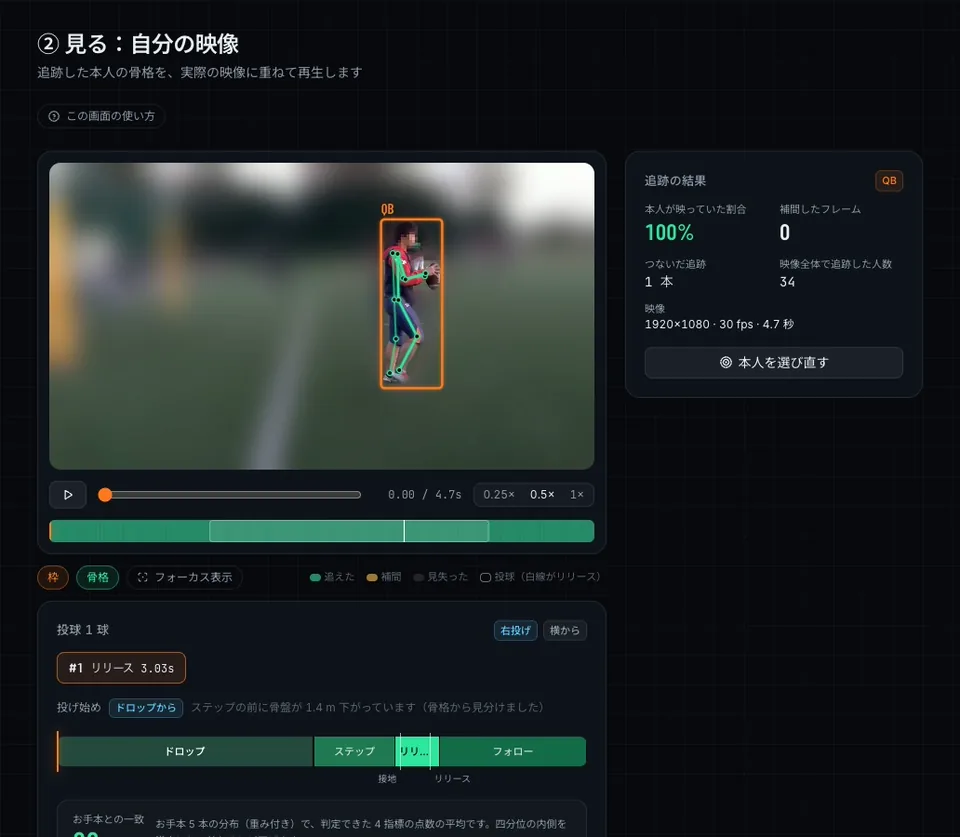
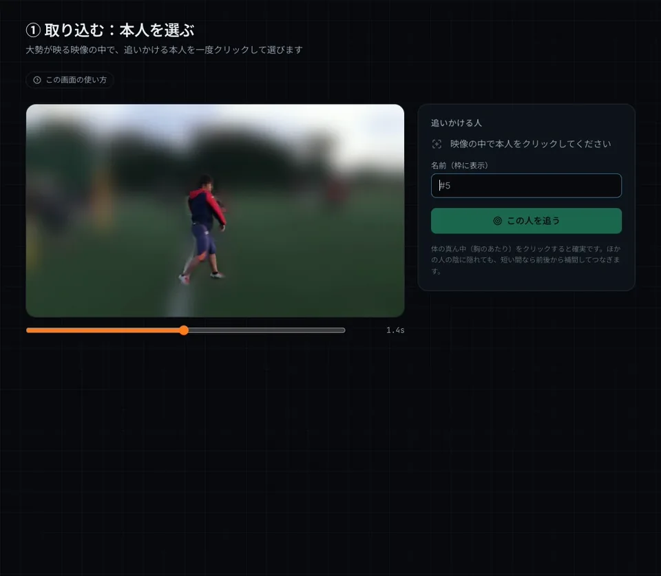
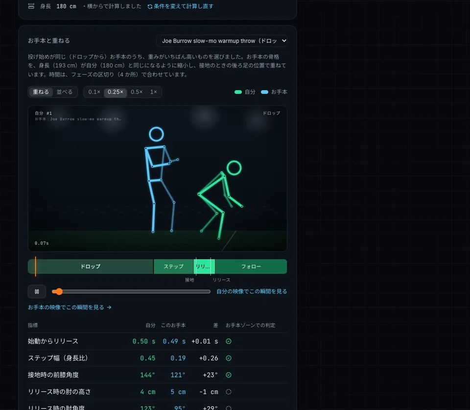
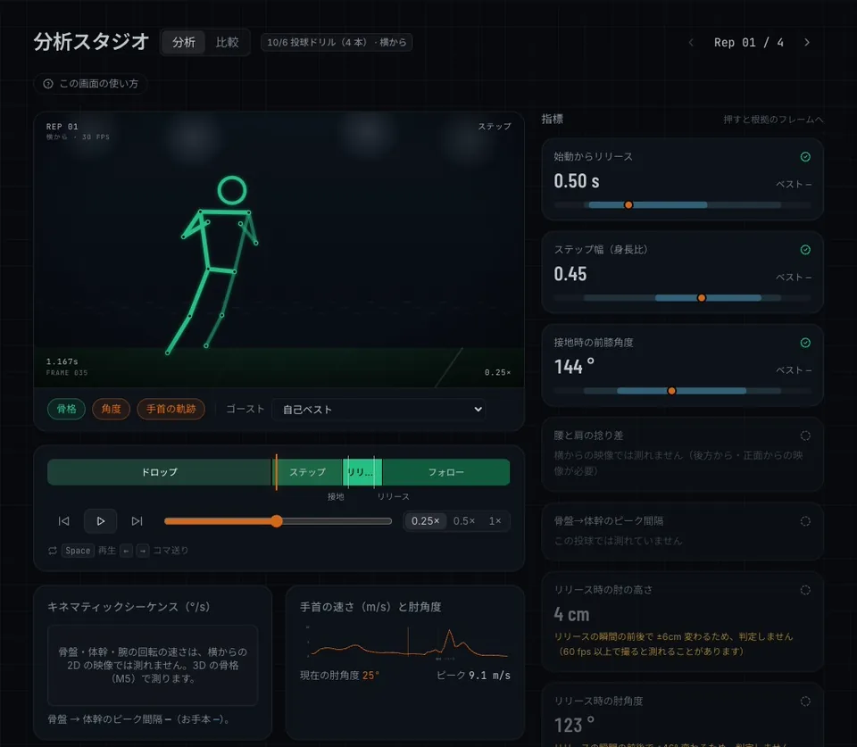
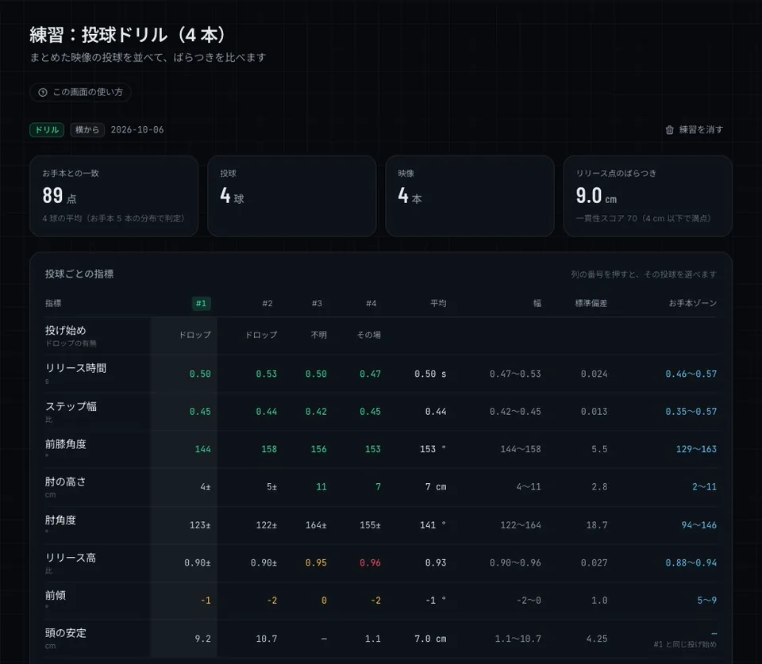
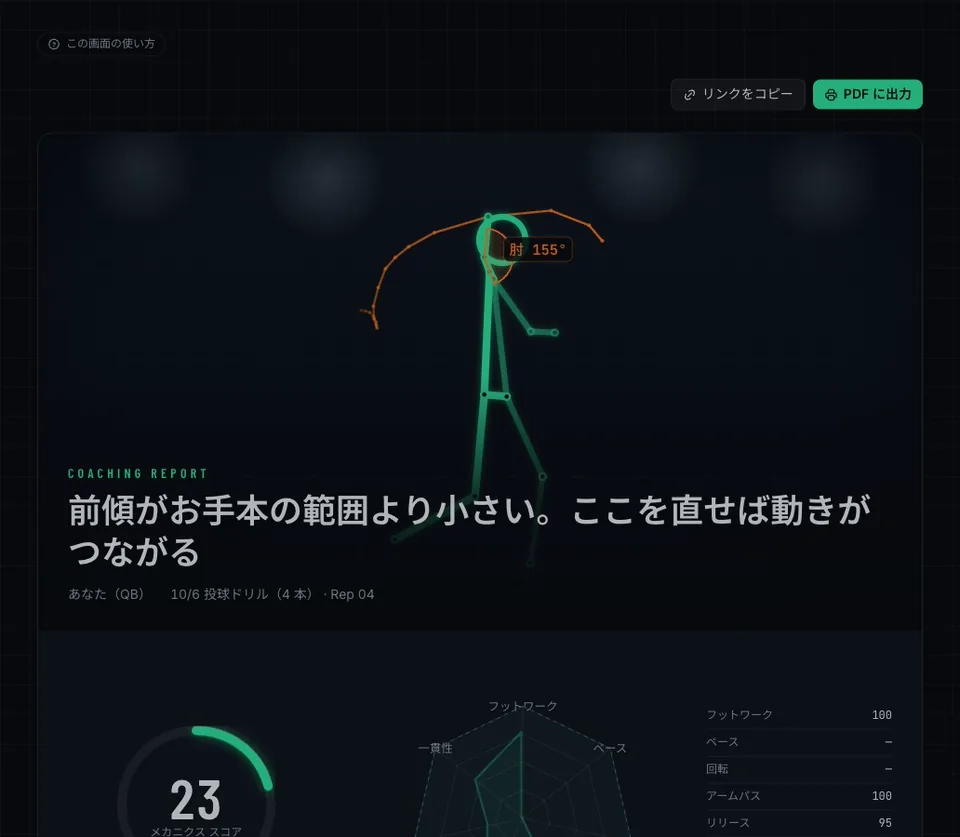
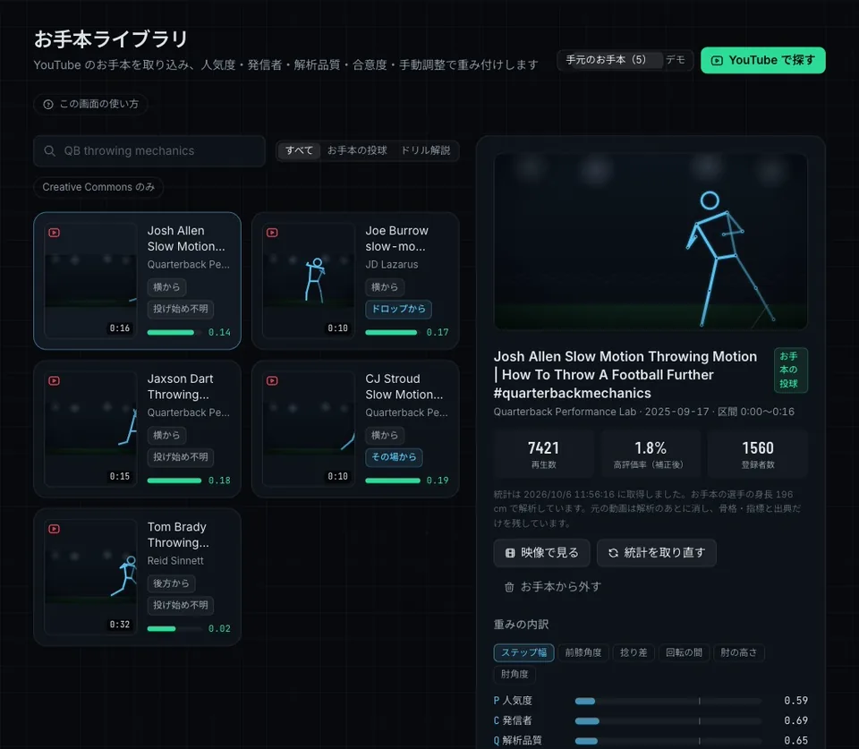
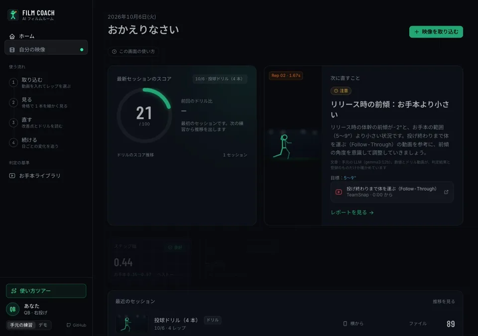
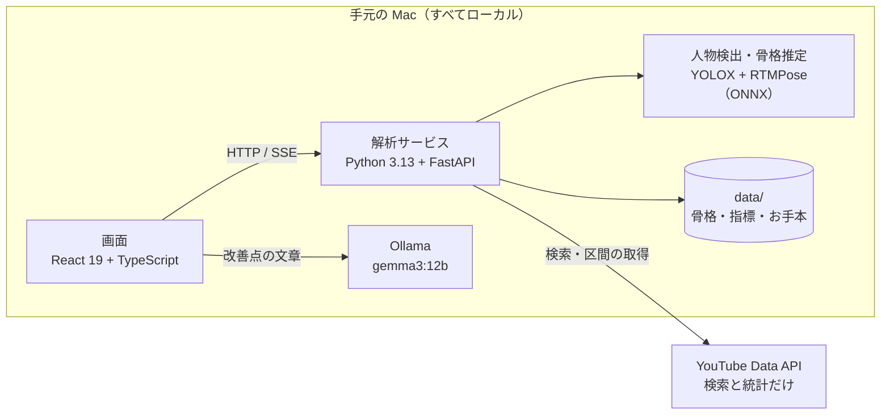

# Film Coach — 自分専用の AI フィルムルーム

[](https://github.com/motoharuinoue/film-coach/actions/workflows/ci.yml)
[](https://motoharuinoue.github.io/film-coach/)

アメリカンフットボールの QB の投球を、スマホで撮った動画から骨格レベルで解析します。YouTube から集めたお手本の分布と比べて、**何が・どちら側に・どれだけずれているか**を、根拠のフレームと練習ドリルの動画を添えて示します。解析も LLM も手元の Mac で動き、無料のツールだけで作っています。

<p align="center"></p>

> ここに載せた動画は、作者が実際に撮った投球ドリル 4 本と、YouTube から取り込んだお手本 5 本の解析結果で、アプリを動かして録ったものです。
>
> - 映像は、本人以外と顔をぼかしています（[`film-coach anonymize`](services/analyzer/README.md)）。
> - YouTube の映像は映していません（骨格と指標だけ。[ADR-0005](docs/adr/0005-youtube-terms-and-copyright.md)）。
> - [公開デモ](https://motoharuinoue.github.io/film-coach/) は合成データで動きます。

## 見どころ

- **大勢が映る映像から、1 回押した本人だけを追う**
  - 1 回押すだけで、全員を検出・追跡したうえで本人だけをつなぎ、17 関節の骨格を出します（YOLOX + RTMPose、ONNX Runtime、CPU）。
  - 場面の切り替わりは自動で見つけます。手持ちで追いかけたカメラの動きは、背景の動きから打ち消します。
- **2D の骨格から QB 指標を出す**
  - 身長から縮尺を求め、画像の座標をメートルに直します。
  - 投球を自動で切り出し、フェーズ（ドロップ → セット → ステップ → リリース → フォロー）に分け、10 の指標を出します。
  - スロー再生の映像も、実際の時間に直して扱います。
- **YouTube のお手本を、重み付きの分布にする**
  - 重みは、人気度 × 発信者 × 解析品質 × 合意度 × 手動調整です。
  - 人気だけに引っ張られないよう、他のお手本から外れた値は合意度で下げます。重みの内訳は全部見せます。
- **条件をそろえて、測れる値だけで判定する**
  - 指標は「大きいほど良い」ではないので、お手本の範囲のどちら側に外れたかで判定します。
  - ドロップの有無（投げ始め）で意味が変わる指標は、同じ投げ始めのお手本とだけ比べます。
  - 映っていない区間からは測りません。リリースの瞬間の時刻のずれで値が大きく変わるもの（30 fps の肘角度など）は判定しません。
- **お手本と重ねて比べる**：お手本の骨格を、フェーズの区切りで時間を、身長で体格を、接地時の後ろ足で位置を合わせて、自分の投球に重ねます。
- **数値をでっち上げない AI コーチ**
  - 判定はルールが行い、手元の LLM（Ollama）は文章にするだけです。
  - 文章に出る数値とドリル動画は、判定結果と登録したものだけかを機械的に確かめます。合わなければテンプレートの文章に戻します。
- **2 つの言語で同じ規則**
  - フェーズ分割と指標は TypeScript（画面）と Python（解析サービス）の両方で実装しています。
  - 共通データで、両方の結果が小数第 9 位まで一致することをテストで確かめます。

## デモ

### 本人を選んで追う

映像の中の本人を 1 回押すと、全員を検出して追跡し、本人の骨格を推定します。進み具合はサーバーから順に届きます（SSE）。



### お手本と重ねて比べる

投げ始めが同じで、重みがいちばん高いお手本を自動で選び、骨格を重ねて動かします。差は良し悪しではないので、判定はお手本ゾーンでの位置で示します。



### 分析スタジオ

骨格の再生、フェーズのタイムライン、手首の速さと肘角度のグラフ、指標ごとの判定を 1 画面で見ます。判定しない値には、その理由と、撮り直すときの fps の目安を出します。



### 練習のばらつき

練習にまとめた投球を並べて、指標のばらつきとリリース点の散らばりを見ます。「±」は、リリースの瞬間の前後で値が大きく変わるため判定しない値です。



### AI コーチのレポート

改善点の文章は手元の LLM（gemma3:12b）が書きます。改善点には、その指標の外れた側を直すドリル動画（登録した YouTube の動画）を添えます。



### お手本ライブラリと重み付け

お手本 1 本ごとに重みの内訳を出し、指標ごとの重み付き分布（お手本ゾーン）を作ります。人気度だけで重み付けした場合とも比べられます。



### ホーム

最新の練習のスコアと、次に直すことを一目で見ます。



## 実際のデータで分かったこと

作者の投球ドリル 4 本（iPhone、1080p・30 fps、手持ち）を、YouTube のお手本 5 本（Burrow・Stroud・Dart・Allen・Brady）と比べました。

- **次に直すこと**
  - リリース時の体幹の前傾が −2〜0° で、お手本の範囲（5〜9°）より小さく、上体が起きていました。
  - 前傾の値は、リリースの前後 2 コマでも数度しか変わらないので、撮り方による見かけではありません。
  - 改善点には、投げ終わりまで体を運ぶドリル（Peyton Manning の Follow-Through）を添えています。
- **30 fps では、肘角度を測れない**
  - リリースの前後 1 コマで、肘角度が 50° 近く変わります（69° → 123° → 160°）。どのコマを取るかで値が決まってしまいます。
  - そこで、瞬間の時刻が半コマずれたときの変わり幅を全部の値に付け、上限を超えた値は判定しないようにしました。
- **投げ始めで、比べる相手を変える**
  - 4 本のうち 2 本はドロップから（骨盤が 1.4 m・1.7 m 下がる）、1 本はその場から、1 本は構えが映っていないので不明でした。
  - 頭の上下動は、同じ投げ始めのお手本とだけ比べます。
- **データの粗を、データで見つけて直した**
  - 最初は「頭の上下動が要改善（お手本 0〜0.6 cm）」と出ていました。
  - 調べると、お手本の 2 本がステップの途中から映っていて、0 フレームから計算した 0.0 が分布をゆがめていました。
  - 映っていない区間からは測らない規則を、両方の言語に入れて直しました。

## 構成



| ディレクトリ | 内容 |
|---|---|
| `apps/web` | 画面（React 19・TypeScript・Vite・Tailwind CSS v4）。フェーズ分割・指標・判定・重み付けのドメインを持ち、公開デモでは合成データで動く |
| `services/analyzer` | 解析サービス（Python 3.13・uv・FastAPI・rtmlib・OpenCV）。取り込み・追跡・骨格推定・投球の解析・お手本とドリル動画の登録 |
| `packages/schema` | 両方の言語で共有する JSON Schema と、結果を突き合わせる共通データ |
| `docs` | 要件・UI・アーキテクチャ・ロードマップ・ADR |

- **クリーンアーキテクチャ**
  - 両方の言語とも、domain / application / infrastructure / adapters（presentation）の 4 層に分けています。
  - 依存の向きはテストで守ります（画面は Vitest、解析サービスは import-linter）。
- **スキーマで約束を決める**
  - 解析サービスの応答の見本は Python が作り、画面のテストが JSON Schema に合うことと、読み込めることを確かめます。
  - フェーズと指標の共通データは TypeScript が作り、Python が同じ結果になることを確かめます。

## 解析の流れ

1. **取り込む**：ファイルか、YouTube の区間（60 秒まで。解析のあとに元の動画は消す）。
2. **本人を追う**
   - 全員を検出して追跡し（IoU、場面の切り替わりで切る）、押した本人につながる追跡をつなぎます。
   - 本人の骨格（COCO の 17 関節）を推定します。
3. **カメラの動きを打ち消す**：人の枠の外の特徴点を追い（LK オプティカルフロー + RANSAC）、各フレームを場面の最初のフレームの座標にそろえます。
4. **関節の取り違えを補う**：信頼度の低い関節と、1〜3 フレームだけ遠くへ飛んで戻る位置を、前後から補います。
5. **画像の座標をワールド 2D に直す**
   - 縮尺：太もも・すね・体幹の長さを、人体の比率で割って身長を見積もる
   - 地面：足首の位置から決める
   - 投げる腕：肩より上にいた時間が長いほうの手首
   - 投げる方向：前の側の肩・腰・足首の位置
6. **投球を見つける**
   - 投げる手首の速さのピーク（身長の 3 倍/秒以上）のうち、手首が肩より上にあるものを投球とします。
   - スロー再生の映像は、倍率を入れて実際の時間に直します。
7. **フェーズと指標**
   - リリース（手首が最も速い瞬間）からさかのぼって、接地・ステップ・セットを決めます。前足と骨盤の横の速さを使います。
   - 10 の QB 指標と、投げ始め（ドロップから／その場から）を出します。
   - 瞬間で測る指標には、瞬間の時刻が半コマずれたときの変わり幅を付けます。

## 判定のしくみ

- **お手本の重み**：w = 人気度 P × 発信者 C × 解析品質 Q × 合意度 K × 手動調整 M（[ADR-0006](docs/adr/0006-reference-weighting.md)）
  - 人気度：高評価率はベイズ平均、再生数は対数で効かせる
  - 発信者：登録者数は対数で効かせ、信頼するチャンネルには加点する
  - 解析品質：関節の信頼度・カメラ角度の適否・解像度・fps
  - 合意度：重み付き中央値と MAD によるロバスト z で、外れた値の重みを下げる
- **お手本ゾーン**：重み付き四分位です。
  - 判定：内側は良好、10〜90% は注意、その外は要改善
  - 大きいほど・小さいほど良いのではなく、範囲のどちら側に外れたかで、文章とドリルを選びます。
- **判定しないもの**
  - カメラ角度で測れない指標
  - 映っていない区間・見つからないステップからの値
  - 投げ始めが分からないときの頭の上下動
  - 半コマの変わり幅が上限を超えた値
- **LLM の文章**（[ADR-0003](docs/adr/0003-rules-judge-llm-writes.md)）
  - 渡す材料：判定の材料と、テンプレートの文章（下書き）
  - 出力：JSON（title・body）に限る
  - 文章の数値が判定結果の値と一致するか、渡していないドリル動画に触れていないかを確かめ、合わなければテンプレートに戻します。

## 処理時間と品質

| 項目 | 結果 |
|---|---|
| 本人の追跡と骨格推定 | 1080p・30 fps・4.7 秒（140 フレーム、映っている人 34 人）を約 20 秒（Apple M4 の CPU） |
| 投球の解析（フェーズと指標） | 0.3 秒 |
| 改善点の文章（gemma3:12b） | 1 件 15〜25 秒。書いた文章はブラウザに覚え、同じ判定なら書き直さない |
| テスト | 画面 262 件（Vitest）、解析サービス 195 件（pytest）。型検査（TypeScript・mypy strict）、ruff、依存の向きの検査 |
| CI | Pull Request ごとに、型検査・テスト・ビルド（画面）と、ruff・mypy・import-linter・pytest（解析サービス） |

## プライバシーと YouTube の規約

- **自分の映像**：解析は手元の Mac だけで行い、外へ送りません。身長はブラウザの中にだけ保存します。
- **YouTube のお手本**：
  - 区間（60 秒まで）だけを取り込み、骨格と指標を出したら元の動画は消します。残すのは派生データと出典だけです。
  - 表示は公式の埋め込みプレイヤーで行います。ドリル動画は取り込まず、YouTube で開くだけです（[ADR-0005](docs/adr/0005-youtube-terms-and-copyright.md)）。
- **公開する映像**：本人以外と顔をぼかした映像だけにします。追跡で求めた本人の体の形だけを残し、顔はモザイクにします（`film-coach anonymize`）。

## 既知の限界

- 単眼の 2D 映像からの推定です。横から全身を撮った映像が向いていて、骨盤と体幹の回転は測れません（3D 化は M5）。
- 30 fps では、リリースの瞬間の肘角度などは判定できません。120 fps 以上のスロー撮影を勧めます。
- お手本は 5 本で、投げ始めごとに分けると分布が薄くなります。
- 骨格の精度（手で付けた正解との比較）は、まだ評価していません。
- 試合映像（22 人が映る映像での追跡、フィールドの座標変換）は M4 で扱います。

## 動かし方

Node 22.12 以上と npm 11 以上を使います（npm 10 には、この依存関係の解決で失敗する不具合があります）。

```bash
npm install
npm run dev      # http://localhost:5173（解析サービスがなければ合成データのデモ）
npm test         # ユニットテストと、依存の向き（層のルール）の検査
npm run build
```

`master` に入ると、GitHub Actions がテストとビルドを通したうえで GitHub Pages にデモを公開します。

### 自分の映像を解析する（手元だけ）

```bash
cd services/analyzer
uv sync
uv run film-coach models download   # 初回だけ（約 145 MB）
uv run film-coach serve             # http://127.0.0.1:8787
# 別のターミナルで
npm run dev                         # http://localhost:5173
```

1. 「自分の映像」でファイルか YouTube の区間を取り込み、フレームの上で本人を押して追跡する
2. 「見る」で身長を入れて「投球を見つける」と、1 球ずつフェーズと QB 指標が出る（横から全身を撮った映像が向いている）
3. 「練習にまとめる」で何本かの映像を選ぶと、練習の画面で投球を比べられる。ホーム・分析スタジオ・レポート・推移も、手元の練習で見られる（サイドバーの「表示するデータ」でデモと切り替える）
4. 「YouTube で探す」でお手本を取り込んで登録すると、判定の基準に加わる。ドリル動画も、候補から取り込まずに登録できる（YouTube Data API のキーが要る）

Ollama を動かしておくと、改善点の文章を手元の LLM が書きます。

```bash
brew install ollama
ollama serve                 # http://127.0.0.1:11434
ollama pull gemma3:12b       # 初回だけ（約 8 GB）
```

解析サービスの詳しい使い方は [services/analyzer/README.md](services/analyzer/README.md)、この README の動画の作り方は [docs/media/README.md](docs/media/README.md) にあります。

## 設計書

要件・UI・アーキテクチャ・ロードマップと、設計判断の記録（ADR）は [docs/README.md](docs/README.md) にまとめています。
