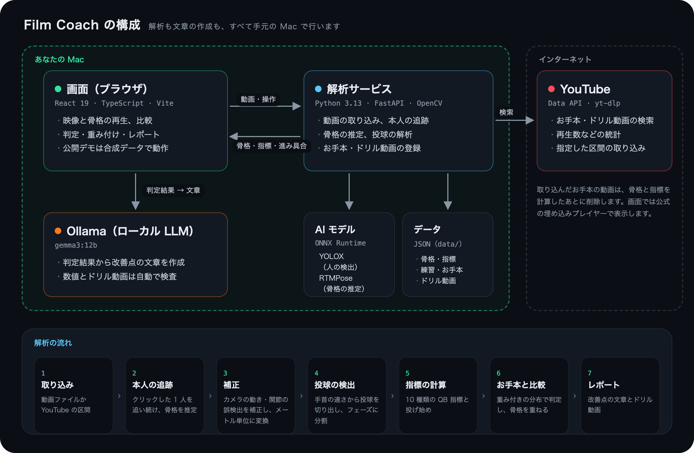

# Film Coach — 自分専用の AI フィルムルーム

[](https://github.com/motoharuinoue/film-coach/actions/workflows/ci.yml)
[](https://motoharuinoue.github.io/film-coach/)
[](LICENSE)

アメリカンフットボールの QB の投球を、スマートフォンで撮った動画から骨格レベルで解析するアプリです。YouTube から集めたお手本と比べて、**どの動きが、どちらの方向に、どれだけずれているか**を、根拠となる場面と練習ドリルの動画を添えて示します。解析もレポートの文章の作成も、すべて手元の Mac で行います。

<p align="center"></p>

> この README の動画は、作者が実際に撮影した投球ドリル 4 本と、YouTube から取り込んだお手本 5 本の解析結果を使い、アプリを操作しながら録画したものです。
>
> - 映像では、本人以外の人をぼかし、本人の顔にはモザイクをかけています（[`film-coach anonymize`](services/analyzer/README.md)）。
> - YouTube の映像は使っていません。お手本は骨格と指標だけを表示しています（[ADR-0005](docs/adr/0005-youtube-terms-and-copyright.md)）。
> - [公開デモ](https://motoharuinoue.github.io/film-coach/)は、合成データで動作します。

## 主な特徴

- **大勢が映る映像でも、本人だけを追い続ける**
  - 映像の中で本人を一度クリックすると、映っている全員を検出・追跡し、その中から本人の動きだけをつなぎ合わせて、17 か所の関節の位置（骨格）を推定します（YOLOX + RTMPose、ONNX Runtime、CPU で動作）。
  - 場面の切り替わり（カット）は自動で検出します。手持ち撮影によるカメラの揺れや移動は、背景の動きから推定して補正します。
- **2D の骨格から QB の指標を計算する**
  - 身長をもとに縮尺を求め、画像上の位置をメートル単位に変換します。
  - 動画から投球の場面を自動で切り出し、ドロップ → セット → ステップ → リリース → フォロースルーの各フェーズに分けたうえで、10 種類の指標を計算します。
  - スロー再生の映像も、実際の時間に換算して扱います。
- **YouTube のお手本に重みを付けて、判定の基準にする**
  - お手本ごとの重みは、次の 5 つを掛け合わせて決めます：①人気度（高評価率・再生数）、②チャンネル（登録者数、信頼するチャンネルか）、③解析品質（関節の検出の確かさ、撮影の角度、画質）、④一致度（他のお手本と値が近いか）、⑤手動調整。
  - 人気だけで基準が決まらないように、他のお手本から大きく外れた値は重みを下げます。重みの内訳は、すべて画面で確認できます。
  - 重み付けの効果は、お手本を選び直す実験（ブートストラップ）と、人気の高い外れ値を加える実験で確かめています（[重み付けの検証](#重み付けの検証)）。
- **条件をそろえ、正しく測れた値だけで判定する**
  - 指標は「大きいほど良い」というものではないため、お手本の範囲から上下どちらに外れているかで判定します。
  - ドロップしてから投げたか、その場から投げたか（投げ始め）によって意味が変わる指標は、投げ始めが同じお手本とだけ比べます。
  - 映像に映っていない区間からは、値を計算しません。また、リリースの瞬間が少しずれただけで大きく変わる値（30 fps の映像での肘角度など）は判定しません。
- **お手本と重ねて比べる**
  - お手本の骨格を、自分の投球に重ねて再生します。
  - 時間はフェーズの区切りで、体の大きさは身長で、位置は前足が着地した瞬間の後ろ足の位置で合わせます。
- **判定結果にない数値を書かない AI コーチ**
  - 判定はルールに基づいて行い、手元の LLM（Ollama）は文章を作るだけです。
  - 文章中の数値とドリル動画が、判定結果や登録済みのものと一致するかを自動で検査し、一致しなければテンプレートの文章に切り替えます。
- **精度を、手で付けた正解で測る**
  - 専用の画面で、関節の位置と接地・リリースの瞬間の正解を手で付け、解析の結果と比べています。
  - 股関節を除く関節の位置の誤差は平均 4.0 cm でした。正解を付けているあいだは、解析の骨格を見せません（[精度の評価](#精度の評価)）。
- **TypeScript と Python で同じ計算規則を実装**
  - フェーズ分割と指標の計算は、画面（TypeScript）と解析サービス（Python）の両方に実装しています。
  - 共通のテストデータで、両者の結果が小数第 9 位まで一致することを確認しています。

## デモ

### 本人を選んで追跡する

映像の中で本人を一度クリックすると、映っている全員を検出・追跡し、本人の骨格を推定します。処理の進み具合は、画面にリアルタイムで表示されます（SSE）。


### お手本と重ねて比べる

投げ始めが同じお手本の中から、重みがいちばん大きいものを自動で選び、骨格を重ねて再生します。1 本のお手本との差が、そのまま良し悪しを表すわけではありません。判定は、自分の値がお手本ゾーン（お手本の値の範囲）に入っているかで示します。


### 分析スタジオ

骨格の再生、フェーズのタイムライン、手首の速さと肘角度のグラフ、指標ごとの判定を、1 つの画面で確認できます。判定しない値には、その理由と、撮り直すときに必要な fps の目安を表示します。


### 練習のばらつき

練習にまとめた投球を並べて、指標のばらつきとリリース点の位置を比べます。「±」の付いた値は、リリースの瞬間の前後で大きく変わるため、判定していません。


### AI コーチのレポート

改善点の文章は、手元の LLM（gemma3:12b）が作成します。各改善点には、その指標のずれを直すためのドリル動画（登録済みの YouTube 動画）へのリンクを添えます。


### お手本ライブラリと重み付け

お手本ごとに重みの内訳を表示し、指標ごとに重み付きの分布（お手本ゾーン）を作ります。人気度だけで重み付けした場合と比べることもできます。


### ホーム

最新の練習のスコアと、次に直すべき点をひと目で確認できます。


## 実際のデータで試して分かったこと

作者の投球ドリル 4 本（iPhone で手持ち撮影、1080p・30 fps）を、YouTube のお手本 5 本（Burrow・Stroud・Dart・Allen・Brady）と比べました。

- **見つかった改善点**
  - リリース時の体幹の前傾が −2〜0° で、お手本の範囲（5〜9°）より小さく、上体が起きていました。
  - ボールが手から離れて見えるフレーム（解析のリリースの 1〜3 コマ後）で測っても 1〜3° で、お手本の範囲に届きません。リリースの瞬間の取り方による誤差ではないと考えられます（[精度の評価](#精度の評価)）。
  - 改善点には、投げ終わりまで体を前へ運ぶドリル（TeamSnap の Follow-Through の解説動画）を添えています。
- **30 fps の映像では、肘角度を正しく測れない**
  - リリースの前後 1 コマで肘角度が 50° 近く変わり（69° → 123° → 160°）、どのコマを使うかで値が決まってしまいます。
  - そこで、着地やリリースの瞬間で測る値には、その瞬間が半コマずれたときにどれだけ変わるか（変わり幅）を付け、変わり幅が上限を超えた値は判定しないようにしました。
- **投げ始めによって、比べるお手本を変える**
  - 4 本のうち 2 本はドロップから（骨盤が 1.4 m・1.7 m 後ろへ下がる）、1 本はその場から投げていました。残りの 1 本は構えが映っていないため、判別できませんでした。
  - 頭の上下動は、投げ始めが同じお手本とだけ比べます。
- **データの不備を、データから見つけて直した**
  - 当初は「頭の上下動が要改善（お手本 0〜0.6 cm）」という判定が出ていました。
  - 調べたところ、お手本のうち 2 本はステップの途中から映っており、映っていない区間（0 フレーム）から計算した 0.0 という値が分布をゆがめていました。
  - 映っていない区間からは値を計算しない規則を、両方の言語の実装に追加して解決しました。

## 重み付けの検証

重みの付け方を 4 通りに変えて、お手本ゾーンがどれだけ動くかを比べました。お手本ライブラリの画面の「重み付けの検証」でも、同じ結果を確認できます。

- **ゾーンの揺れ**：お手本を重複を許して選び直し、ゾーンを計算し直すことを 1,000 回くり返したときの、四分位の標準偏差（ブートストラップ）
- **外れ値によるずれ**：再生数 500 万回・登録者数 200 万人の動画が、既存のお手本から大きく外れた値を持つとして加えたときの、四分位の動き
- どちらも、お手本の値の幅（最大 − 最小）に対する割合です。小さいほど、ゾーンが安定しています。

| 重みの付け方（手元のお手本 5 本） | ゾーンの揺れ | 外れ値によるずれ（値の幅の 1 倍外れた値） | 外れ値によるずれ（値の幅の 3 倍外れた値） |
|---|---|---|---|
| P×C×Q×K×M（採用） | 25.6% | 25.4% | **11.4%** |
| 一致度 K を除く | 25.2% | 44.0% | 89.1% |
| 人気度 P だけ | 25.2% | 31.3% | 59.9% |
| すべて同じ重み | 25.3% | **22.7%** | 39.4% |

- **検証で見つけた弱点を直した**
  - 最初の検証では、採用した重み付けのほうが、すべて同じ重みよりゾーンの揺れが大きく（30.6%）、外れ値も抑えきれていませんでした（3 倍の外れ値で 33.9%）。
  - 原因は、一致度の基準（中央値）を人気度で重み付けしていたことでした。人気の高い外れ値ほど、基準を自分の側へ引き寄せていました。
  - 基準を人気度とチャンネルに左右されない重みで求め、異なる値が 3 つ以下のときは一致度を使わないように直しました（[ADR-0006](docs/adr/0006-reference-weighting.md)）。
- **外れ値には強い**：大きく外れた人気の動画によるずれを、人気度だけで重み付けした場合の 5 分の 1 ほどに抑えます。デモの合成データ（お手本 8 本）では、1 倍の外れ値でも 4 分の 1 ほどです。
- **揺れは、お手本の本数で決まる**：ゾーンの揺れはどの付け方でもほぼ同じで、5 本では値の幅の 25% ほどあります。判定を安定させるには、お手本を増やすことが先決です。

## 精度の評価

作者の投球ドリル 4 本（30 fps）の 17 フレームに、関節 13 か所の位置と、接地・リリースの瞬間の正解を手で付け、解析の結果と比べました。正解は、画面の「精度の評価」で付けます。付けているあいだは、正解が引っ張られないよう、解析の骨格と瞬間を見せません。

| 関節の位置（指標に使う骨格と、正解の点との距離） | 平均 | 中央値 | 5 cm 以内 | 10 cm 以内 |
|---|---|---|---|---|
| 股関節を除く 11 か所 | **4.0 cm** | 3.1 cm | 77% | 95% |
| 頭（鼻） | 2.0 cm | 1.8 cm | 100% | 100% |
| 肩 | 4.2 cm | 3.2 cm | 73% | 93% |
| 肘 | 3.6 cm | 3.2 cm | 79% | 100% |
| 手首 | 6.4 cm | 4.9 cm | 52% | 81% |
| 膝 | 3.6 cm | 3.3 cm | 79% | 100% |
| 足首 | 3.0 cm | 2.3 cm | 88% | 100% |
| 股関節 | 15.5 cm | 14.8 cm | 0% | 6% |

| 瞬間・指標 | 解析との差（平均） |
|---|---|
| 接地 | 17 ms（4 球中 3 球は同じフレーム） |
| リリース | 75 ms（4 球とも解析が 1〜3 コマ早い） |
| ステップ幅 | 身長の 1.0% |
| 接地時の前膝角度 | 19.9°（股関節の点の付け方の違いによる。下記） |
| リリース時の肘の高さ | 8.1 cm |
| リリース時の肘角度 | 36.9°（4 球とも、変わり幅が大きいとして判定から外している） |

- **股関節は、点の付け方が違う**
  - モデルの股関節は、正解より平均 14.2 cm 上にあり、その差は毎回ほぼ同じでした（標準偏差 3.5 cm）。手で付けた「太ももの付け根」より、モデルは骨盤の横の高い位置に点を置いています。
  - 前膝角度（股関節・膝・足首の角度）が手で測った値より平均 20° 大きく出るのは、主にこのためです。正解の股関節を 14 cm 上へずらすと、差は 1〜9° に縮みます。
  - お手本も同じモデルで測るため、お手本との比較には影響しません。ただし、本などに載っている角度と、そのまま比べることはできません。
- **リリースは、ボールが離れて見える瞬間より少し早い**
  - 解析は「手首が最も速い瞬間」をリリースとしています。そのため、ボールが手から離れて見えるフレームより、平均 75 ms（1〜3 コマ）早くなりました。
  - お手本も同じ規則で測るので、比べる条件はそろっています。
  - 改善点の前傾（−2〜0°）は、ボールが離れて見えるフレームで測っても 1〜3° で、お手本の範囲（5〜9°）に届きません。前傾そのものは、リリースの瞬間に奥の肩が隠れるため、手では測れませんでした。
- **リリースの瞬間の腕は、30 fps では測りにくい**
  - 肘角度の差（平均 37°）には、瞬間のずれと、像が流れた腕の骨格の誤差の両方が効いています。
  - 4 球とも、瞬間が半コマずれたときの変わり幅が上限を超えるとして、判定から外していました。手で測った結果からも、この規則が妥当だと確かめられました。

同じ表は、`uv run film-coach evaluate` で出せます（[services/analyzer/README.md](services/analyzer/README.md)）。

## 構成

<p align="center"></p>

| ディレクトリ | 内容 |
|---|---|
| `apps/web` | 画面（React 19・TypeScript・Vite・Tailwind CSS v4）。フェーズ分割・指標・判定・重み付けの計算も持つ。公開デモでは合成データで動作する |
| `services/analyzer` | 解析サービス（Python 3.13・uv・FastAPI・rtmlib・OpenCV）。動画の取り込み・追跡・骨格の推定・投球の解析・お手本とドリル動画の登録 |
| `packages/schema` | 両方の言語で共有する JSON Schema と、計算結果を照合するための共通テストデータ |
| `docs` | 要件・UI・アーキテクチャ・ロードマップの設計書と、設計判断の記録（ADR） |

- **クリーンアーキテクチャ**：両方の言語とも、domain / application / infrastructure / adapters（presentation）の 4 層に分け、層の依存の向きをテストで検査しています（画面は Vitest、解析サービスは import-linter）。
- **JSON Schema で、画面と解析サービスのデータ形式をそろえる**
  - 解析サービスの応答の見本を Python 側で生成し、画面側のテストで、JSON Schema に合っていることと正しく読み込めることを確認します。
  - フェーズと指標の共通テストデータは TypeScript 側で生成し、Python 側で同じ結果になることを確認します。

## 解析の流れ

1. **取り込み**：動画ファイル、または YouTube の区間（60 秒まで。解析後に元の動画は削除）。
2. **本人の追跡**
   - 映っている全員を検出・追跡し（枠の重なり〔IoU〕で対応付け、場面の切り替わりで区切る）、クリックした本人の追跡をつなぎ合わせます。
   - 本人の骨格（COCO 形式の 17 関節）を推定します。
3. **カメラの動きの補正**：人の枠の外にある背景の特徴点を追跡し（LK オプティカルフロー + RANSAC）、各フレームを場面の最初のフレームの座標にそろえます。
4. **関節の誤検出の補正**：信頼度の低い関節や、1〜3 フレームだけ離れた位置に飛ぶ関節を、前後のフレームから補間します。
5. **画像上の位置から実際の位置（2D）への変換**
   - 縮尺：太もも・すね・体幹の長さと人体の標準的な比率から、画像上の身長を見積もる
   - 地面：足首の位置から決める
   - 投げる腕：肩より上にあった時間が長いほうの腕
   - 投げる方向：体の前側（右投げなら左側）の肩・腰・足首の位置から決める
6. **投球の検出**
   - 投げる手首の速さのピーク（1 秒あたり身長の 3 倍以上）のうち、手首が肩より上にあるものを投球とみなします。
   - スロー再生の映像は、倍率を指定して実際の時間に換算します。
7. **フェーズ分割と指標の計算**
   - リリース（手首が最も速い瞬間）から時間をさかのぼり、前足の着地・ステップの開始・セットの瞬間を決めます。これらの瞬間は、前足と骨盤の水平方向の速さから求めます。
   - 10 種類の QB 指標と、投げ始め（ドロップから／その場から）を求めます。
   - 着地やリリースの瞬間で測る値には、その瞬間が半コマずれたときの変わり幅を付けます。

## 判定のしくみ

- **お手本の重み**：w = 人気度 P × チャンネル C × 解析品質 Q × 一致度 K × 手動調整 M（[ADR-0006](docs/adr/0006-reference-weighting.md)）
  - 人気度：高評価率はベイズ平均で補正し、再生数は対数で効かせる
  - チャンネル：登録者数を対数で効かせ、信頼するチャンネルには加点する
  - 解析品質：関節の検出の信頼度、カメラの角度がその指標に合っているか、解像度、fps
  - 一致度：他のお手本の値の重み付き中央値から大きく外れた値ほど、重みを下げる（MAD によるロバストな z 値）。中央値と MAD は人気度とチャンネルを掛けない重みで求め、異なる値が 4 つ未満のときは使わない
- **お手本ゾーン**：お手本の値の重み付き四分位で決めます。
  - 判定：四分位の内側なら良好、10〜90% の範囲なら注意、その外なら要改善
  - 値が大きいほど・小さいほど良いのではなく、範囲から上下どちらに外れたかによって、改善点の文章とドリル動画を選びます。
- **判定しないもの**
  - カメラの角度で測れない指標
  - 映っていない区間や、見つからなかったステップから計算される値
  - 投げ始めが分からないときの頭の上下動
  - 瞬間が半コマずれたときの変わり幅が上限を超えた値
- **LLM による文章**（[ADR-0003](docs/adr/0003-rules-judge-llm-writes.md)）
  - 渡すもの：判定の材料と、テンプレートの文章（下書き）
  - 出力の形式：JSON（title・body）に限定
  - 文章中の数値が判定結果の値と一致するか、渡していないドリル動画に触れていないかを検査し、問題があればテンプレートの文章に切り替えます。

## 処理時間と品質

| 項目 | 結果 |
|---|---|
| 本人の追跡と骨格の推定 | 1080p・30 fps・4.7 秒の動画（140 フレーム、映っている人は 34 人）で約 20 秒（Apple M4 の CPU） |
| 投球の解析（フェーズと指標） | 0.3 秒 |
| 改善点の文章の作成（gemma3:12b） | 1 件あたり 15〜25 秒。作成した文章はブラウザに保存し、判定が同じなら再利用する |
| テスト | 画面 292 件（Vitest）、解析サービス 214 件（pytest）。型検査（TypeScript・mypy strict）、ruff、層の依存の向きの検査 |
| CI | Pull Request ごとに、画面の型検査・テスト・ビルドと、解析サービスの ruff・mypy・import-linter・pytest を実行 |

## プライバシーと YouTube の規約

- **自分の映像**：解析は手元の Mac だけで行い、外部には送信しません。身長はブラウザの中にだけ保存します。
- **YouTube のお手本**
  - 指定した区間（60 秒まで）だけを取り込み、骨格と指標を計算したあとで元の動画を削除します。保存するのは、解析で得たデータと出典だけです。
  - 表示には公式の埋め込みプレイヤーを使います。ドリル動画は取り込まず、YouTube 上で開くだけです（[ADR-0005](docs/adr/0005-youtube-terms-and-copyright.md)）。
- **公開する映像**：README などで公開する映像は、追跡で求めた本人の体の部分だけを残してほかをぼかし、本人の顔にもモザイクをかけたものだけです（`film-coach anonymize`）。

## 現時点での制約

- 1 台のカメラで撮った映像から、2D の骨格を推定しています。横から全身を撮った映像に向いています。骨盤と体幹の回転は測れません（3D 化は M5 で対応する予定です）。
- 30 fps の映像では、リリースの瞬間の肘角度などは判定できません。120 fps 以上のスロー撮影をおすすめします。
- お手本はまだ 5 本で、お手本ゾーンは値の幅の 25% ほど揺れます（[重み付けの検証](#重み付けの検証)）。投げ始めごとに分けると、比較に使えるデータはさらに少なくなります。
- 精度の評価は、作者 1 人の映像 4 本（17 フレーム）だけで行っています。お手本の YouTube の映像は解析のあとに消すため、正解を付けられません。
- 試合映像の解析（フィールド上の座標への変換、ポケット内の動きの指標など）は、M4 で対応する予定です。

## 動かし方

Node 22.12 以上と npm 11 以上が必要です（npm 10 では、依存関係の解決に失敗する不具合があります）。

```bash
npm install
npm run dev      # http://localhost:5173（解析サービスが動いていなければ、合成データのデモが開く）
npm test         # ユニットテストと、層の依存の向きの検査
npm run build
```

`master` にマージされると、GitHub Actions がテストとビルドを実行したうえで、GitHub Pages にデモを公開します。

### 自分の映像を解析する（手元だけで動作）

```bash
cd services/analyzer
uv sync
uv run film-coach models download   # 初回だけ（約 145 MB）
uv run film-coach serve             # http://127.0.0.1:8787
# 別のターミナルで
npm run dev                         # http://localhost:5173
```

1. 「自分の映像」で動画ファイルか YouTube の区間を取り込み、フレーム上で本人をクリックして追跡します。
2. 「見る」画面で身長を入力して「投球を見つける」を押すと、1 球ずつフェーズと QB 指標が表示されます（横から全身を撮った映像に向いています）。
3. 「練習にまとめる」で複数の映像を選ぶと、練習の画面で投球を比較できます。ホーム・分析スタジオ・レポート・推移も、手元の練習のデータで表示されます（サイドバーの「表示するデータ」でデモと切り替えられます）。
4. 「YouTube で探す」でお手本を取り込んで登録すると、判定の基準に加わります。ドリル動画も、検索結果から取り込まずに登録できます（YouTube Data API のキーが必要です）。

Ollama を起動しておくと、改善点の文章を手元の LLM が作成します。

```bash
brew install ollama
ollama serve                 # http://127.0.0.1:11434
ollama pull gemma3:12b       # 初回だけ（約 8 GB）
```

解析サービスの詳しい使い方は [services/analyzer/README.md](services/analyzer/README.md) に、この README の動画と図の作り方は [docs/media/README.md](docs/media/README.md) にまとめています。

## 設計書

要件・UI・アーキテクチャ・ロードマップの設計書と、設計判断の記録（ADR）は [docs/README.md](docs/README.md) にまとめています。

## ライセンス

ソースコードは [MIT ライセンス](LICENSE)で公開しています。ただし、`docs/media/` の動画と画像（作者が撮影した映像を含む）は、このライセンスの対象外です。無断での利用はご遠慮ください。
